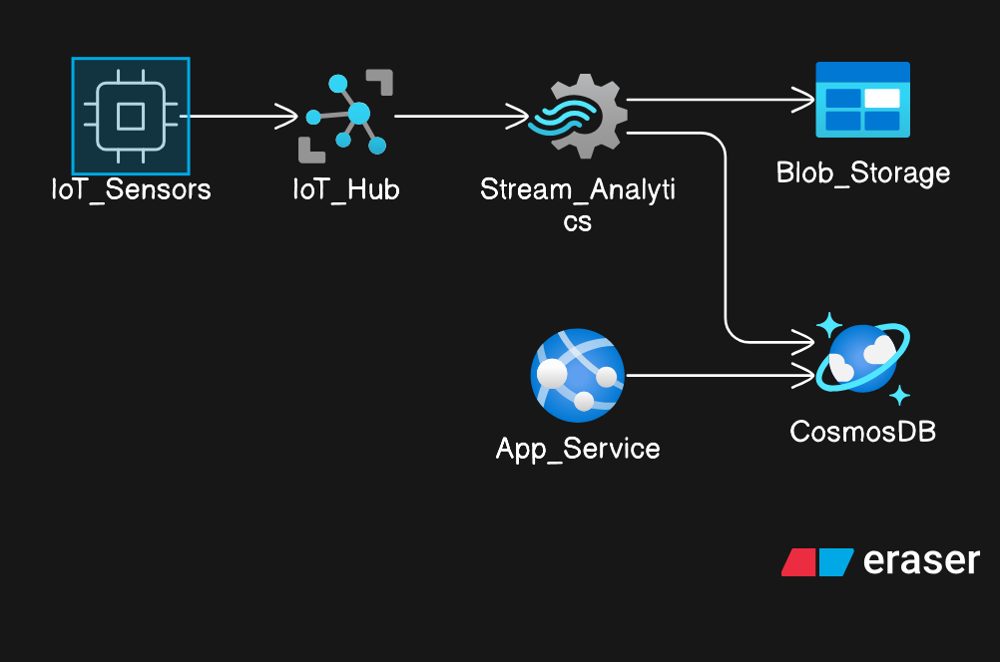

# Rideau Canal Monitoring System

A comprehensive IoT monitoring system for the historic Rideau Canal, built using Azure cloud services to provide real-time data collection, processing, and visualization of canal conditions.

## Student Information

**Name:** [Your Name]  
**Student ID:** [Your Student ID]  

### Repository Links
- **Sensor Simulation:** [rideau-canal-sensor-simulation](../rideau-canal-sensor-simulation)
- **Web Dashboard:** [rideau-canal-dashboard](../rideau-canal-dashboard)
- **Main Documentation:** [rideau-canal-monitoring](../rideau-canal-monitoring) (this repository)

## Scenario Overview

### Problem Statement
The Rideau Canal, a UNESCO World Heritage Site, requires continuous monitoring to ensure safe navigation conditions, environmental health, and proper maintenance scheduling. Traditional manual monitoring methods are labor-intensive and provide limited real-time insights.

### System Objectives
- Provide real-time monitoring of canal conditions (water level, temperature, flow rate, etc.)
- Enable predictive maintenance through data analysis
- Offer accessible web-based dashboard for stakeholders
- Demonstrate scalable IoT architecture using Azure cloud services

## System Architecture

### Data Flow Explanation
1. IoT sensors collect environmental data from canal locations
2. Data is transmitted to Azure IoT Hub for ingestion
3. Stream Analytics processes real-time data streams
4. Processed data is stored in Cosmos DB for querying
5. Raw data is archived in Blob Storage for historical analysis
6. Web dashboard displays real-time and historical data
7. Alerts and notifications are triggered based on thresholds

### Azure Services Used
- **Azure IoT Hub** - Device management and data ingestion
- **Stream Analytics** - Real-time data processing
- **Cosmos DB** - NoSQL database for processed data
- **Blob Storage** - Raw data archival
- **App Service** - Web dashboard hosting
- **Application Insights** - Monitoring and diagnostics

## Implementation Overview

### IoT Sensor Simulation
Python-based simulator that generates realistic canal sensor data including water levels, temperature, flow rates, and environmental conditions.
- **Repository:** [rideau-canal-sensor-simulation](../rideau-canal-sensor-simulation)
- **Technology:** Python, Azure IoT SDK

### Azure IoT Hub Configuration
- Device registration and management
- Message routing and endpoint configuration
- Security and authentication setup

### Stream Analytics Job
Real-time data processing and transformation pipeline.
- **Query Location:** [stream-analytics/query.sql](stream-analytics/query.sql)
- Input from IoT Hub
- Output to Cosmos DB and Blob Storage

### Cosmos DB Setup
NoSQL database configuration for storing processed sensor data with optimized queries for dashboard consumption.

### Blob Storage Configuration
Cold storage solution for raw sensor data archival and historical analysis.

### Web Dashboard
Real-time visualization dashboard built with modern web technologies.
- **Repository:** [rideau-canal-dashboard](../rideau-canal-dashboard)
- **Technology:** Node.js, HTML5, CSS3, JavaScript
- **Features:** Real-time charts, historical data views, alert management

### Azure App Service Deployment
Cloud hosting configuration for the web dashboard with continuous deployment pipeline.

## Repository Links

- **Sensor Simulation Repository:** [rideau-canal-sensor-simulation](../rideau-canal-sensor-simulation)
- **Web Dashboard Repository:** [rideau-canal-dashboard](../rideau-canal-dashboard)
- **Live Dashboard Deployment:** [Dashboard URL - To be added after deployment]

## Video Demonstration

[Video demonstration will be embedded here or linked once recorded]

## Setup Instructions

### Prerequisites
- Azure subscription
- Python 3.8+
- Node.js 14+
- Git

### High-Level Setup Steps
1. Clone all three repositories
2. Set up Azure resources (IoT Hub, Stream Analytics, Cosmos DB, Blob Storage)
3. Configure sensor simulation with IoT Hub connection strings
4. Deploy Stream Analytics job with provided query
5. Configure and deploy web dashboard to App Service
6. Run sensor simulation to begin data flow

**Detailed setup instructions are available in each component repository.**

## Results and Analysis

### Sample Outputs and Screenshots
[Screenshots will be added to the screenshots/ folder]

### Data Analysis
- Real-time data processing performance metrics
- Data accuracy and sensor reliability analysis
- System scalability observations

### System Performance Observations
- Latency measurements from sensor to dashboard
- Throughput analysis for concurrent sensor streams
- Cost analysis of Azure services usage

## Challenges and Solutions

### Technical Challenges Faced
- **Challenge 1:** Stream Analytics outputing to the Cosmodb
  - **Solution:** in the requirement there was mention of using the documentID, there was a confuse about the what was it used for. Entered {location}-{timestamp} in the field. so when starting the job analytics, it would out put the DB. it until the documents states that it's the key for the DB found the json.

- **Challenge 2:** [Describe specific technical challenge]
  - **Solution:** [How you solved it]

### Lessons Learned
- Best practices for IoT device management
- Stream processing optimization techniques
- Cost optimization strategies for cloud resources

## AI Tools Disclosure (if used)

### Tools Used and How
- **Tool Name:** [Specific AI tool if used]
- **Purpose:** [What it was used for]
- **AI-Generated Content:** [Specify what was AI-generated]
- **Original Work:** [Specify what was your own implementation]

## References

### Libraries and Frameworks
- Azure IoT SDK for Python
- Node.js Express framework
- Chart.js for data visualization
- Bootstrap for responsive design

### Other Resources
- Azure IoT Hub documentation
- Stream Analytics query reference
- Cosmos DB best practices
- Rideau Canal historical data sources

---

**Project Status:** [In Development / Completed]  
**Last Updated:** [Date]
